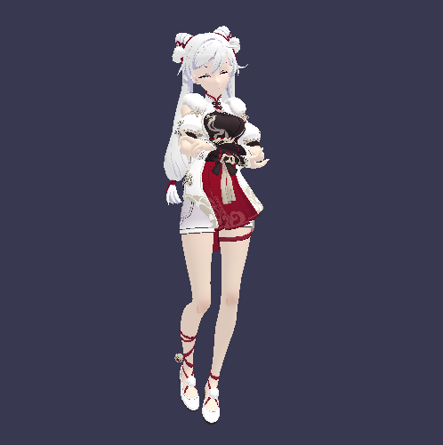
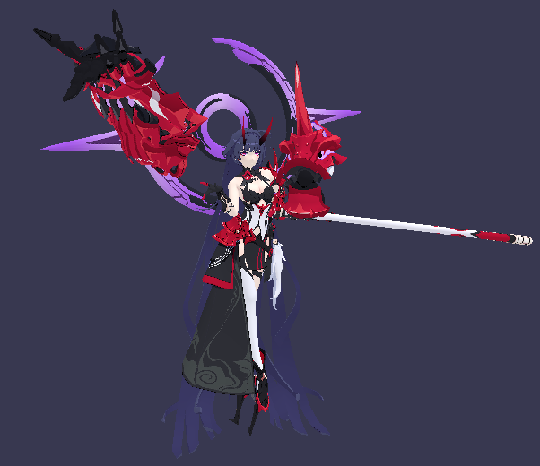

#  SRender

SRender is a software renderer written from scratch in C++11 with no dependencies (except win32 for display image) for windows platform. 

The purpose of writing this renderer is mainly for better understanding basic CG knowledge and algorithms. You can feel free to make changes on this project.  Here some screenshots of SRender:

### Image-based lighting


### Blinn-Phong Shading





## Main Features

* Blinn-Phong shading
* Perspective correct interpolation
* Back-face culling
* Homogeneous clipping
* Cubemap skybox
* Physically based rendering (PBR)
* Metallic-roughness workflow
* Image-based lighting (IBL)
* movable camera

## Binaries for Usage

The pre-built binaries can be found in binary_exe_file. You can start with binaries and obj assets. (Note: the obj document should in the parent directory of binaries)

The obj models are a little bit big, it can also be downloaded from here:

https://pan.baidu.com/s/1_EgKzcFXJLCuDi1o5fhQww

extract code: ghde

## Build

If you want to check more details of SRender, the cmakelists.txt file is provided for building project files using [CMake](https://cmake.org/).

For visual studio:

```
mkdir build
cd build
cmake -G "Visual Studio 15 2017" ..
start Renderer.sln
```


You can also directly open the SRender file with [CLION](https://www.jetbrains.com/clion/), it will automatically configure the project.


## Control of Camera

* Rotation: holding left mouse button
* Pan: holding right mouse button
* Zoom: mouse wheel

## Reference

zauonlok's implementation of [software renderer](https://github.com/zauonlok/renderer).

...

